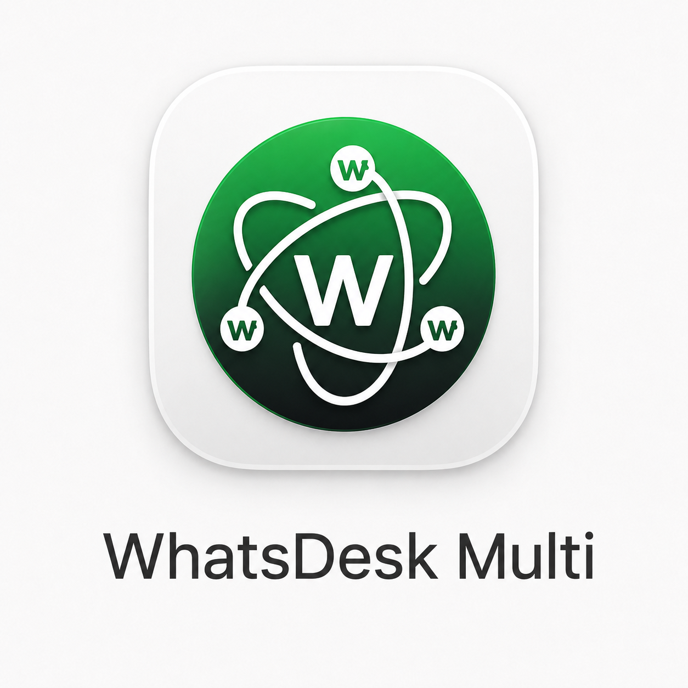
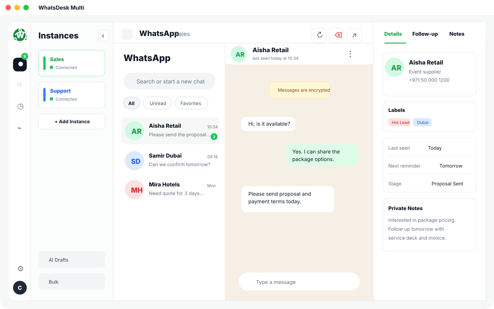
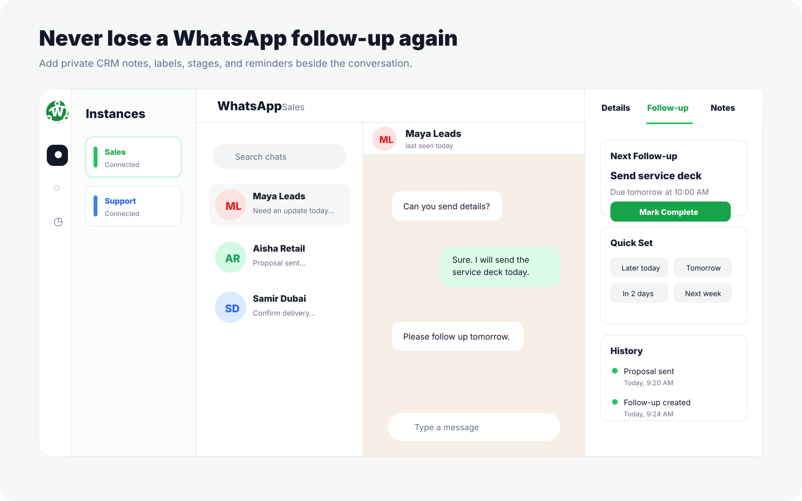
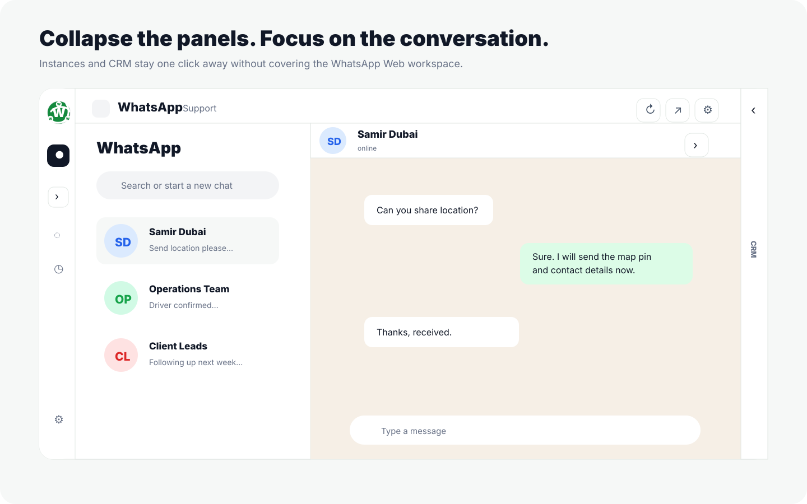

# WhatsDesk Multi



**One desktop app for all your WhatsApp accounts.**

WhatsDesk Multi helps you manage multiple WhatsApp and WhatsApp Business accounts from one focused desktop workspace, with lightweight CRM notes, labels, and follow-up reminders built around your chats.

[Download for macOS](https://github.com/cdsaa79/whatsdesk-multi/releases/download/v1.0.1/WhatsDesk.Multi-1.0.1-arm64.dmg) · [Download for Windows](https://github.com/cdsaa79/whatsdesk-multi/releases/download/v1.0.1/WhatsDesk.Multi.Setup.1.0.1.exe) · [All releases](https://github.com/cdsaa79/whatsdesk-multi/releases/latest) · [Report an issue](https://github.com/cdsaa79/whatsdesk-multi/issues) · [Request a feature](https://github.com/cdsaa79/whatsdesk-multi/issues/new?template=feature_request.md)

> Free to use for personal work and inside businesses. You may not sell, rebrand, paid-host, or charge others for WhatsDesk Multi itself. See [License](LICENSE).

## Why This Exists

WhatsApp is no longer just a personal messaging app.

Today, many people run more than one WhatsApp identity:

- Personal WhatsApp
- Business WhatsApp
- Sales number
- Support number
- Team or operations number
- Client-specific number
- Country-specific number
- Side-business number

The normal workflow is painful. You end up switching browser profiles, juggling Chrome tabs, scanning QR codes again, missing messages, and losing context between chats.

**WhatsDesk Multi gives you one calm place to manage all of it.**

It is for founders, sales teams, agencies, recruiters, event companies, support teams, consultants, operators, and anyone whose work happens across multiple WhatsApp accounts.

## Download and Install

### Direct macOS Installer

1. Download [WhatsDesk Multi DMG for macOS](https://github.com/cdsaa79/whatsdesk-multi/releases/download/v1.0.1/WhatsDesk.Multi-1.0.1-arm64.dmg).
2. Open the `.dmg` file.
3. Drag **WhatsDesk Multi** into **Applications**.
4. Launch the app and add your first WhatsApp instance.

Because the app is not notarized yet, macOS may show a security warning on first launch. If that happens:

1. Open **System Settings**.
2. Go to **Privacy & Security**.
3. Click **Open Anyway** for WhatsDesk Multi.

### Direct Windows Installer

1. Download [WhatsDesk Multi Setup for Windows](https://github.com/cdsaa79/whatsdesk-multi/releases/download/v1.0.1/WhatsDesk.Multi.Setup.1.0.1.exe).
2. Run the installer.
3. Launch **WhatsDesk Multi** from the Start Menu or desktop shortcut.
4. Add your first WhatsApp instance and scan the QR code.

The Windows app uses the same isolated WhatsApp Web sessions, local CRM drawer, reminders, labels, and approved WhatsDesk Multi icon. Windows may show a SmartScreen warning because the app is not code-signed yet.

## What You Can Do With It

### Manage Multiple WhatsApp Accounts

Create separate workspaces for each number:

- Sales
- Support
- Personal
- Operations
- UAE number
- India number
- Client account
- WhatsApp Business account

Each account stays isolated, so you do not have to keep logging in and out.

### Stop Losing Follow-Ups

WhatsApp chats move fast. Important leads get buried.

WhatsDesk Multi adds a small CRM drawer where you can:

- Add private notes
- Add labels like `Hot Lead`, `Customer`, `Supplier`, `Payment Pending`
- Set lead status
- Save next action
- Create follow-up reminders
- Keep customer context beside the chat

### Use WhatsApp Like a Work Inbox

Instead of “just chats,” you get a simple workflow:

```text
New WhatsApp message
→ Open the right account
→ Add note or label
→ Set follow-up
→ Continue the conversation
```

No spreadsheet. No separate CRM tab. No forgotten customer.

## Who It Is For

WhatsDesk Multi is useful if you:

- Use more than one WhatsApp account on desktop
- Run both personal WhatsApp and WhatsApp Business
- Manage sales conversations on WhatsApp
- Use WhatsApp for customer support
- Need reminders for follow-ups
- Work with many suppliers, leads, or clients
- Want a cleaner alternative to browser profile switching

## Key Features

- **Multiple isolated WhatsApp Web sessions**  
  Add many WhatsApp accounts and switch between them quickly.

- **Compact desktop workspace**  
  Keep all accounts in one app instead of many browser windows.

- **Local CRM sidebar**  
  Notes, labels, stages, owners, custom fields, and follow-ups beside the active chat.

- **Follow-up reminders**  
  Create reminders so important WhatsApp conversations do not disappear.

- **WhatsApp link router**  
  Choose which account should open a `wa.me`, `api.whatsapp.com`, `web.whatsapp.com`, `whatsapp://`, or `whatsdesk://` link.

- **Session controls**  
  Rename, reload, clear session, mute, and delete individual instances.

- **WhatsApp Web calling support**  
  Allows WhatsApp Web microphone and camera permissions for voice and video calls when WhatsApp enables calling for the current account/browser session.

- **Local-first privacy**  
  CRM data stays on your computer. The app does not intentionally store full message history, media files, attachments, passwords, or encryption keys.

## What Makes It Different

Most tools either:

- force you into a heavy CRM,
- support only official WhatsApp Business API numbers,
- or make you use browser profiles and tabs.

WhatsDesk Multi is different because it focuses on the everyday reality:

**many people already have multiple WhatsApp accounts, and they need one simple tool to manage all communication without changing how they use WhatsApp.**

## Built for Growth, Kept Free

The goal is to make WhatsDesk Multi useful for thousands of people who rely on WhatsApp every day.

If it saves you time:

- Star the repo
- Share it with another WhatsApp-heavy user
- Open issues for bugs
- Suggest improvements
- Contribute UI, packaging, CRM, or macOS polish

## Current Status

WhatsDesk Multi is an early desktop MVP.

What works today:

- Multiple WhatsApp Web instances
- Separate sessions per instance
- QR login per account
- Link routing
- Local CRM notes and labels
- Follow-up reminders
- WhatsApp Web voice/video call permission support
- Basic contact detection from visible WhatsApp Web context
- macOS packaging as DMG and ZIP
- Windows packaging as installer and ZIP

What is still improving:

- App signing and notarization
- Contact detection for some WhatsApp Business screens
- Search across CRM notes and contacts
- Export/import
- Better release automation
- Better screenshots and onboarding

## Screenshots

All screenshots below use fictional sample data. No real chats, phone numbers, customer names, QR codes, or WhatsApp account data are shown.

### Multi-Account Workspace

Manage multiple WhatsApp accounts, switch between isolated sessions, and keep CRM context beside the active chat.



### Follow-Up CRM

Turn fast-moving WhatsApp conversations into a simple sales/support workflow with reminders and private notes.



### Collapsed Focus Mode

Collapse the instance drawer or CRM drawer when you need more space for conversation.



## Privacy

WhatsDesk Multi stores local app and CRM metadata, such as:

- Instance names and colors
- Muted state
- Local CRM contacts
- Notes
- Labels
- Follow-ups
- Custom fields

WhatsDesk Multi does not intentionally store:

- Full WhatsApp message history
- Attachments
- Media files
- WhatsApp passwords
- WhatsApp encryption keys

WhatsApp Web session cookies and login state are stored by Electron in the normal app data directory so your linked devices can stay logged in.

## Important Note About WhatsApp

WhatsDesk Multi is not an official WhatsApp or Meta product.

It uses WhatsApp Web in isolated desktop sessions. It does not use hidden WhatsApp APIs, bypass encryption, or access WhatsApp private internals.

Contact and business information detection is best-effort because WhatsApp Web can change its interface at any time.

## Developer Setup

Requirements:

- macOS, Windows, or Linux for development
- Node.js 20+
- npm

```bash
npm install
npm start
```

Check the app:

```bash
npm run check
npm audit --omit=dev
```

Build macOS package:

```bash
npm run package:mac
```

Build Windows package:

```bash
npm run package:win
```

Build outputs are created in:

```text
dist/
```

## Brand

Name: **WhatsDesk Multi**  
Tagline: **Multiple WhatsApp accounts. One focused desktop workspace.**  
Short description: **A free-to-use desktop app for managing multiple WhatsApp Web accounts with local CRM notes and follow-up reminders.**

Brand files live in:

```text
docs/brand/
```

## License

WhatsDesk Multi is licensed under [BSD 3-Clause with Commons Clause](LICENSE).

You may use it personally or inside your business. You may study, modify, and share the code.

You may not sell WhatsDesk Multi, rebrand it as a paid product, offer it as a paid hosted service, or charge others for access/support where WhatsDesk Multi is the substantial value.

## Disclaimer

WhatsDesk Multi is an independent project and is not affiliated with, endorsed by, sponsored by, or approved by WhatsApp LLC, Meta Platforms, Inc., or any of their affiliates. WhatsApp is a trademark of its respective owner.
