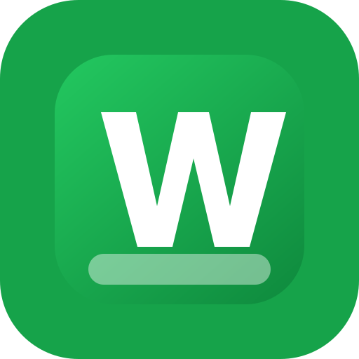

# WhatsDesk Multi

**WhatsDesk Multi is a free, source-available macOS desktop app for managing multiple WhatsApp Web sessions in one clean workspace.** It is built for people who run separate WhatsApp accounts for sales, support, operations, personal work, or client communication and want a focused desktop experience with lightweight CRM notes.

> License: BSD 3-Clause with Commons Clause. You can use WhatsDesk Multi personally or inside a business, study it, modify it, and share it. You may not sell it, rebrand it for paid distribution, offer it as a paid hosted service, or charge others for access/support where the app is the substantial value.



## Why WhatsDesk Multi?

WhatsApp Web is useful, but switching between multiple accounts in browser profiles is messy. WhatsDesk Multi gives every account its own isolated desktop session, then adds a simple CRM layer for labels, notes, follow-ups, and reminders.

Search-friendly summary:

- Multiple WhatsApp accounts on Mac
- Multi-session WhatsApp Web desktop manager
- WhatsApp CRM for macOS
- Separate WhatsApp Web profiles in one app
- WhatsApp Business and personal account workspace
- Local-first WhatsApp notes, labels, and follow-up reminders

## Features

- **Multiple isolated WhatsApp Web instances**  
  Create separate sessions for Sales, Support, Personal, Operations, or any other WhatsApp account. Each instance uses its own persistent Electron partition.

- **One-window desktop workspace**  
  Switch accounts from a compact sidebar instead of juggling browser profiles, tabs, or separate Chrome windows.

- **Lightweight CRM drawer**  
  Add private notes, labels, owner, stage/status, custom fields, and follow-up reminders linked to the active chat.

- **Follow-up reminders**  
  Create pending follow-ups and receive native macOS notifications when they are due.

- **WhatsApp link router**  
  Open `wa.me`, `api.whatsapp.com`, `web.whatsapp.com`, `whatsapp://`, and `whatsdesk://` links with the instance you choose.

- **Free for real business use**  
  Use it for your own company, team, sales workflow, support desk, or operations. The restriction is on reselling or monetizing WhatsDesk Multi itself.

- **Local-first storage**  
  App metadata and CRM records are stored locally on your Mac. The app does not store full message history, attachments, or WhatsApp credentials.

- **Per-instance controls**  
  Rename, reload, clear session, mute, and delete individual WhatsApp instances without affecting the others.

## Screenshots

Screenshots are intentionally not committed yet because real WhatsApp chats may contain private information. Before publishing, add redacted screenshots under:

```text
docs/screenshots/
```

Recommended GitHub images:

- Main workspace with two instances
- QR login screen
- CRM details drawer
- Follow-up tab
- Collapsed drawer/focus mode

## How It Works

WhatsDesk Multi is an Electron app that embeds WhatsApp Web in isolated `BrowserView` sessions. Each instance gets a separate persistent partition:

```text
persist:wa-{instanceId}
```

The CRM panel uses best-effort visible UI detection from the active WhatsApp Web chat. It does not access WhatsApp private APIs, encryption internals, hidden storage, or full message history.

## Important Limitations

WhatsDesk Multi is not an official WhatsApp or Meta product.

WhatsApp does not provide a public API for building a full native clone of the WhatsApp desktop client for personal accounts. This project uses WhatsApp Web inside isolated desktop sessions. Contact detection is best-effort because WhatsApp Web can change its DOM at any time.

For official business messaging integrations, use the WhatsApp Business Platform / Cloud API. That is a different product direction from this multi-account WhatsApp Web manager.

## Install for Development

Requirements:

- macOS
- Node.js 20+
- npm

```bash
npm install
npm start
```

## Verify

```bash
npm run check
npm audit --omit=dev
```

## Build macOS App

```bash
npm run package:mac
```

Build outputs are created under:

```text
dist/
```

Do not commit `dist/`, `node_modules/`, local app data, or private screenshots.

## Data and Privacy

WhatsDesk Multi stores:

- App instance metadata
- Instance names, colors, mute settings, and active instance
- Local CRM contacts generated from visible chat context
- Notes, labels, follow-ups, custom fields, and activity entries

WhatsDesk Multi does not intentionally store:

- Full WhatsApp message history
- Attachments
- Media files
- WhatsApp passwords
- WhatsApp encryption keys

Electron and WhatsApp Web store session cookies and login state in the normal app user-data directory so linked devices can remain logged in.

## Brand

Name: **WhatsDesk Multi**  
Short description: **A multi-account WhatsApp Web desktop workspace for macOS with local CRM notes.**  
Tagline: **Multiple WhatsApp accounts. One focused Mac workspace.**

Logo files live in:

```text
docs/brand/
```

## GitHub Topics

Use these topics when publishing the repository:

```text
whatsapp
whatsapp-web
whatsapp-desktop
whatsapp-business
macos
electron
crm
productivity
multi-account
desktop-app
source-available
free-to-use
no-resale
```

## Roadmap

- Better redacted screenshot set
- Signed and notarized macOS releases
- Improved contact detection for WhatsApp Business profiles
- Search for CRM notes and contacts
- Export/import local CRM records
- Optional SQLite storage backend
- Better keyboard shortcuts
- Theme support
- Contributor-friendly issue templates

## Contributing

Contributions are welcome. Please read [CONTRIBUTING.md](CONTRIBUTING.md) and [CODE_OF_CONDUCT.md](CODE_OF_CONDUCT.md).

Good first issues:

- Improve macOS UI polish
- Add tests around link parsing
- Improve CRM detection fallbacks
- Add screenshot redaction helpers
- Improve accessibility labels and keyboard navigation

## License

WhatsDesk Multi is licensed under [BSD 3-Clause with Commons Clause](LICENSE).

This means normal personal and business use is allowed, but selling the app, rebranding it as a paid product, paid hosting, or charging for services where WhatsDesk Multi is the substantial value is not allowed without separate written permission.

## Disclaimer

WhatsDesk Multi is an independent project and is not affiliated with, endorsed by, sponsored by, or approved by WhatsApp LLC, Meta Platforms, Inc., or any of their affiliates. WhatsApp is a trademark of its respective owner.
